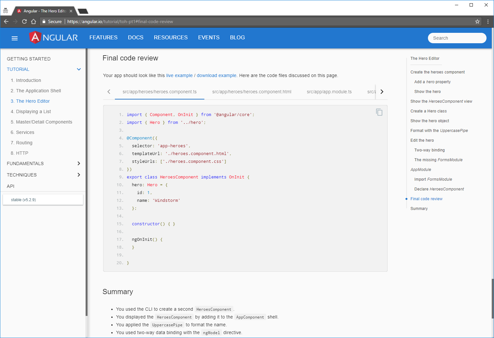
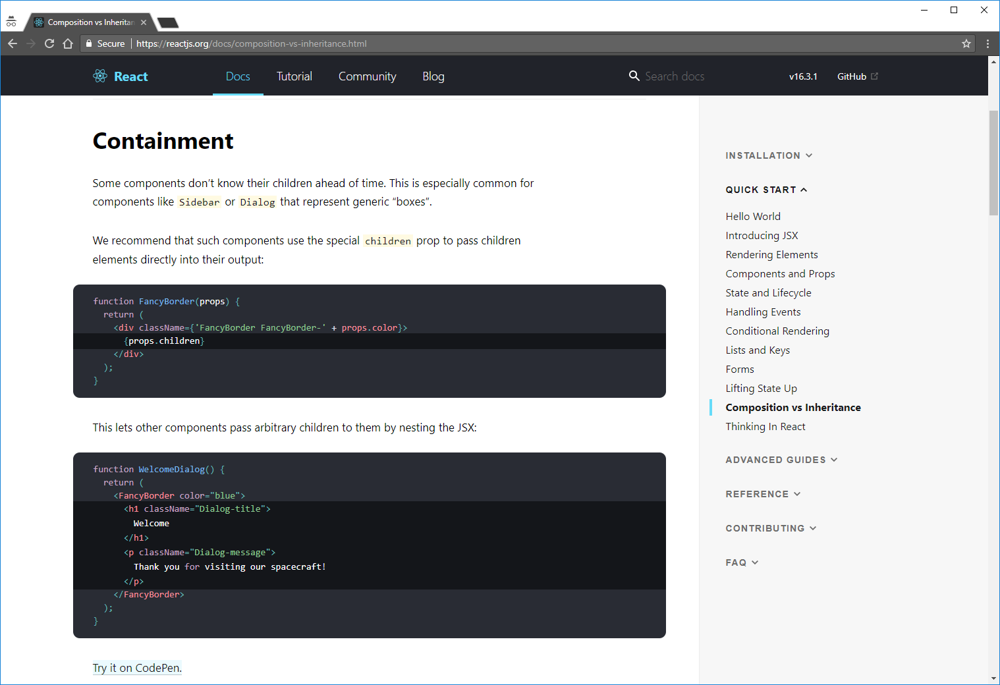
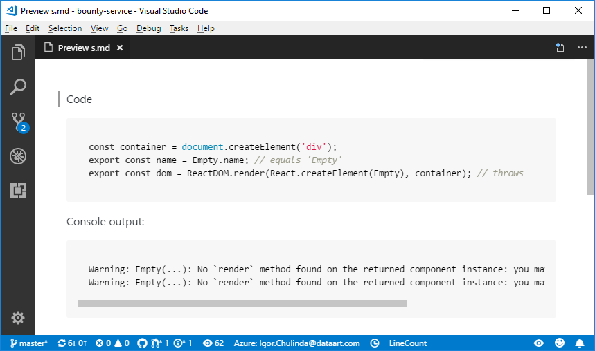

# Is TDD wrong?

> **DISCLAIMER:** your attention was captured by clickbait. Obviously, TDD isn’t wrong, but… There is always some ‘but’.

## Introduction

First six years of my career I was freelancing and participating in small start-ups at initial phase. So no tests… Really, not single one.

In such circumstances you have to deliver features for ‘yesterday’. Because market requirements constantly changing, test will be obsolete, when you’ll finish them. And even these tests can be created only if you know what you want to develop, and it’s not always true. Doing R&D you may don’t know what your final goal is. And when you reach some point, you can’t be sure that it won’t dramatically change tomorrow. In fact there are business reasons to save time by avoiding unit-testing.

Ok, our industry is much larger than just start-ups.  
Nearly 2 years ago I was hired by pretty big outsourcing company that has clients of any sizes.  
During kitchen-talks with my colleagues, I’ve discovered that mostly everybody agrees that unit-testing and TDD is kind of ‘best practice’.  But in all projects where I was participating, there were no tests. And not, it wasn’t my decision. Yes, I know that there are projects that has good test coverage. There are such projects in my company too. But those well tested project also heavily bureaucratized.

So what’s the problem?  
Why everybody agrees that TDD is good, but nobody actually follows it?  
Is TDD wrong? – No!  
Probably, it has no business value? – And again, no!  
Are developers lazy? – Yes! But it’s not a reason.  
Problem is tests themselves!  
Yes, it sounds weird, but I’ll try to prove it. 

## Problem is tests!
According to [this survey](https://stateofjs.com/) `Testing Tools` had the lowest overall happiness score in 2016 and 2017. I didn’t find similar earlier information, but it doesn’t really matter.

### A little bit of history
In 2008th one of the firsts test frameworks ([QUnit](https://qunitjs.com/)) was released.  
In 2010 Jasmine appeared.  
In 2011 – Mocha.  
First release which I found for Jest was in 2014.

// Here should be slide with timeline of test frameworks’ releases

For comparison.  
In 2010 angular was released.  
Ember was introduced in 2011.  
react appeared in 2013.  
And so on…

> No js frameworks was created during preparation for this topic...  
At least by me.

// Additional timeline for js frameworks on same slide

At same period of time we’ve seen rise and fall of grunt, then gulp. After that we’ve realized the power of npm scripts and webpack was released.

// Additional timeline for js tools

Everything changed during last 10 years. Everything except testing.

### Small Quiz
Let’s check your knowledge. What library/framework is it?  
1:
```JavaScript
var hiddenBox = $("#banner-message");
$("#button-container button").on("click", function(event) {
    hiddenBox.show();
});
```
2:  
```TypeScript
@Component({
    selector: 'app-heroes',
    templateUrl: './heroes.component.html',
    styleUrls: ['./heroes.component.css']
})
export class HeroesComponent{
    hero: Hero = {
        id: 1,
        name: 'Windstorm'
    };

    constructor() { }
}
```
3:  
```JavaScript
function Avatar(props) {
    return (
        
    );
}
```
Answers:  
1. [JQuery](https://jquery.com/)
2. [Angular2+](https://angular.io/)
3. [React](https://reactjs.org/)

Ok, good. I'm pretty sure that your answers were correct in all cases. But what about test frameworks?  
1:  
```JavaScript
var assert = require('assert');
describe('Array', function() {
  describe('#indexOf()', function() {
    it('should return -1 when the value is not present', function() {
      assert.equal([1,2,3].indexOf(4), -1);
    });
  });
});
```
2:  
```JavaScript
const sum = require('./sum');

test('adds 1 + 2 to equal 3', () => {
  expect(sum(1, 2)).toBe(3);
});
```
3:  
```JavaScript
test('timing test', function (t) {
    t.plan(2);
    
    t.equal(typeof Date.now, 'function');
    var start = Date.now();
    
    setTimeout(function () {
        t.equal(Date.now() - start, 100);
    }, 100);
});
```
4:  
```JavaScript
let When2IsAddedTo2Expect4 = 
    Assert.AreEqual(4, 2+2)
```
Answers:  
1. [Mocha](https://mochajs.org/)
2. [Jest](https://facebook.github.io/jest/)
3. [Tape](https://github.com/substack/tape)
4. [Test for F#](http://fsharp.org/)

You may guess some answers, but in general all these tools are very similar. You may see that even in different languages things remain mostly the same.

So we have at least 8 years experience with unit-testing in JavaScript world. 
But we just adapted something already existing at that point of time. Unit-testing as we know it appeared much earlier. If we will take release of [Test Anything Protocol](https://en.wikipedia.org/wiki/Test_Anything_Protocol) (1987) as starting point, then we use existing approach longer than I live.

[TDD](https://en.wikipedia.org/wiki/Test-driven_development) itself isn't much younger than automated unit-testing, [if not older](https://www.quora.com/Why-does-Kent-Beck-refer-to-the-rediscovery-of-test-driven-development-Whats-the-history-of-test-driven-development-before-Kent-Becks-rediscovery). It brings us to the point where we can properly assess its pros and cons.

## TDD overview
In order to be at the page same, let me remind you what is TDD.

> Test-driven development (TDD) is a software development process that relies on the repetition of a very short development cycle: requirements are turned into very specific test cases, then the software is improved to pass the new tests, only.

// Diagram with `add test->test fail->code->test passed->refactoring->add test` cycle

But what do we benefit from using it?

### Tests are formalized requirements
Actually it's true only partially.

TDD as practice was "rediscovered" by Kent Beck in 1999, while [Agile Manifesto](http://agilemanifesto.org/) was accepted only 2 years later (in 2001). I have to mention it in order to make you understand that TDD was born in "Golden Age" of [waterfall model](https://en.wikipedia.org/wiki/Waterfall_model) and this fact determines the circumstances and processes for which it was designed. Obviously, TDD will work best in exactly such cases.

So, if you work in project, where:

1. Requirements are clear;
2. You fully understand them;
3. They are stable and won't be changed frequently.

You may create tests that will act as formalized requirements.  
But in order to treat _existing_ tests in same manner, following statements has to be true too:

1. Tests don't have bugs;
2. They are up to date;
3. And they cover nearly all use cases (don't confuse with code coverage).

So **"Tests are formalized requirements"** is true only in case of existing those requirements _before_ actual development, like in "Waterfall model" or [NASA](https://www.nasa.gov/) projects, where "customers" are scientists/engineers.

> In some circumstances it may work in "Agile" process as well. Especially if workaround like [BDD](https://en.wikipedia.org/wiki/Behavior-driven_development) is used, but that's another story.

### TDD forces good architecture
And again it's true only partially.  
TDD forces modularity, which is necessary but not sufficient for good architecture.

Architecture quality depends on developers. Experienced developers are able to write high-quality code regardless of whether or not unit-testing is used.  
On the other hand, semiskilled developers will produce low-quality code covered by low-quality tests, because creating good tests is an art form, as well as programming itself.

Yes, tests like sex: "better bad than none at all". But...  
This test doesn't bring you closer to good system design:
```TypeScript
import { inject, TestBed } from '@angular/core/testing';

import { UploaderService } from './uploader.service';

describe('UploaderService', () => {
    beforeEach(() => {
        TestBed.configureTestingModule({
            providers: [UploaderService],
        });
    });

    it('should be created', inject([UploaderService], (service: UploaderService) => {
        expect(service).toBeTruthy();
    }));
});
```
Because, it actually doesn't test anything.
> And we used 15 lines of code to test nothing.

But next test also won't make your architecture better:
```JavaScript
var IotSimulation = artifacts.require("./IotSimulation.sol");
var SmartAsset = artifacts.require("./SmartAsset.sol");
var BuySmartAsset = artifacts.require("./BuySmartAsset.sol");

var BigInt = require('big-integer');

contract('BuySmartAsset', function (accounts) {

    it("Should sell asset", async () => {
        var deliveryCity = "Lublin";

        var extra = 1000; //
        var gasPrice = 100000000000;


        const smartAsset = await SmartAsset.deployed();
        const iotSimulation = await IotSimulation.deployed();
        const buySmartAsset = await BuySmartAsset.deployed()

        const result = await smartAsset.createAsset(Date.now(), 200, "docUrl", 1, "email@email1.com", "Audi A8", "VIN02", "black", "2500", "car");
        const smartAssetGeneratedId = result.logs[0].args.id.c[0];

        await iotSimulation.generateIotOutput(smartAssetGeneratedId, 0);
        await iotSimulation.generateIotAvailability(smartAssetGeneratedId, true);
        await smartAsset.calculateAssetPrice(smartAssetGeneratedId);

        const assetObjPrice = await smartAsset.getSmartAssetPrice(smartAssetGeneratedId);
        assert.isAbove(parseInt(assetObjPrice), 0, 'price should be bigger than 0');

        await smartAsset.makeOnSale(smartAssetGeneratedId);

        var assetObj = await smartAsset.getAssetById.call(smartAssetGeneratedId);
        assert.equal(assetObj[9], 3, 'state should be OnSale = position 3 in State enum list');

        await smartAsset.makeOffSale(smartAssetGeneratedId);
        assetObj = await smartAsset.getAssetById.call(smartAssetGeneratedId);
        assert.equal(assetObj[9], 2, 'state should be PriceCalculated = position 2 in State enum list');

        await smartAsset.makeOnSale(smartAssetGeneratedId);

        const calculatedTotalPrice = await buySmartAsset.getTotalPrice.call(smartAssetGeneratedId, '112', '223');
        await buySmartAsset.buyAsset(smartAssetGeneratedId, '112', '223', { from: accounts[1], value: BigInt(calculatedTotalPrice.toString()).add(BigInt(extra)) });

        assetObj = await smartAsset.getAssetById.call(smartAssetGeneratedId);
        assert.equal(assetObj[9], 0, 'state should be ManualDataAreEntered = position 0 in State enum list');
        assert.equal(assetObj[10], accounts[1]);

        const balanceBeforeWithdrawal = await web3.eth.getBalance(accounts[1]);
        const gas = await buySmartAsset.withdrawPayments.estimateGas({ from: accounts[1] });
        await buySmartAsset.withdrawPayments({ from: accounts[1], gasPrice: gasPrice });

        const balanceAfterWithdrawal = await web3.eth.getBalance(accounts[1]);

        var totalGas = gas * gasPrice;

        assert.isOk((BigInt(balanceAfterWithdrawal.toString()).add(BigInt(totalGas))).eq(BigInt(balanceBeforeWithdrawal.toString()).add(BigInt(extra))));
    })
})
```
Biggest problem of this test is initial code base, but it could be greatly improved even without refactoring of already working project.

Actually TDD's impact on resulting architecture is approximately on same level as impact of chosen framework/library, if not less (e.g. [Nest](https://nestjs.com/), [RxJs](https://github.com/Reactive-Extensions/RxJS) and [MobX](https://github.com/mobxjs/mobx) IMO have much bigger impact than TDD).

But neither TDD nor frameworks will prevent anybody from writing poor-quality code and making bad design choices.

> There is no **silver bullet**.

### TDD saves time
Ok, it depends.  
Let's assume that everybody in project is confident enough with chosen test framework, TDD methodology and best practices of unit-testing.  
And there are no misunderstood in all this stuff.  
And requirements are clear and stable.  
And developers team understands them in same manner as product owner.  
And management is ready to handle all organizational issues, caused by it (e.g. longer onboarding for new programmers).

Even in this case, you'll have to invest some efforts first, which will increase initial development phase and only later you'll get it back by decreasing time spent for bugfixing and maintenance.  
Yes, second could probably be bigger than first. In this case you'll get some profit from TDD.  
In some cases you'll also save time while implementing new features, because test will show unintentional breaking changes.  
But in real world, which is very dynamic, requirements may change and something that was valid before will become invalid. In this case you'll have to rewrite tests according to new reality. And, obviously, spend new efforts, that won't be paid back immediately.

// Diagram with another TDD cycle, that represents what happens, when requirements changes.

### Tests are the best documentation
No. It's good, but definitely not the best.

Let's take a look at [angular docs](https://angular.io/docs):


Or [react docs](https://reactjs.org/docs/):


What do you think they have in common? - They both are built around **code samples**. And even more. All this samples are easily runnable (angular uses [StackBlitz](https://stackblitz.com) and react - [CodePen](https://codepen.io)), so you are able to see output and what happens if you change something.  
Of course, they also have some text content, but it's like comments in code - you need them only if you don't understand something in underlying code.

_**Runnable code samples**_ is the best documentation!

Tests are close to this, but they aren't just executable code samples.
```TypeScript
describe('ReactTypeScriptClass', function() {
  beforeEach(function() {
    container = document.createElement('div');
    attachedListener = null;
    renderedName = null;
  });

  it('preserves the name of the class for use in error messages', function() {
    expect(Empty.name).toBe('Empty');
  });

  it('throws if no render function is defined', function() {
    expect(() =>
      expect(() =>
        ReactDOM.render(React.createElement(Empty), container)
      ).toThrow()
    ).toWarnDev([
      // A failed component renders twice in DEV
      'Warning: Empty(...): No `render` method found on the returned ' +
        'component instance: you may have forgotten to define `render`.',
      'Warning: Empty(...): No `render` method found on the returned ' +
        'component instance: you may have forgotten to define `render`.',
    ]);
  });
```
It's a small part from [real react test](https://github.com/facebook/react/blob/master/packages/react/src/__tests__/ReactTypeScriptClass-test.ts). We may separate code samples from it:
```TypeScript
container = document.createElement('div');
Empty.name;
```
```TypeScript
container = document.createElement('div');
ReactDOM.render(React.createElement(Empty), container);
```
Everything else is manually created infrastructure code for testing.

Let's be honest, previous test sample is far less readable than real docs. And problem isn't in this particular test - I believe guys from [facebook](https://www.facebook.com/) know how to write good code and good tests: ) All this stuff from testing tools and assertion libraries, like `it`, `describe`, `test`, `to.be.true` just blows up your test suites.

> There is a library called [tape](https://github.com/substack/tape) with minimal API, because any test can be rewritten using only `equal`/`deepEqual` and thinking in this terms is generally good practice for unit-testing. But even `tape`'s tests are far away from being just **executable code samples**.

But I have to admit that it definitely usable as documentation. It really less likely to be outdated, and on the other hand our minds just throw away everything unimportant, while reading tests. If we try to visualize our thoughts in that moment, we get something like this:


As you can see - it's much closer to real docs than initial test.

### As an intermediate conclusion

1. **Tests are formalized requirements** if they are stable;
2. **TDD forces good architecture** if developers are qualified enough;
3. **TDD saves time** if you invest it first;
4. **Tests are the best documentation** if there are no other executable code samples.

So TDD is wrong, isn't it? - No, TDD isn't wrong.  
It shows right direction and raises important questions. We just have to rethink and change the way we apply it.

## So what's the solution?
Don't treat TDD as silver bullet.  
Don't treat it even as a process on same level as Agile for example.  
Instead focus on its real strengths:

1. Preventing unintentional breaking changes, in other words freezing existing behavior as some sort of 'baseline';
2. Using documentation samples as tests.

Think of unit-testing as a developer's tool. Like [linter](https://eslint.org/) or [compiler](https://www.typescriptlang.org/).

> For example, you won't ask Product Owner about using linter - instead you'll just use it.

Someday it will be true for unit-testing too. When efforts required for TDD will be somewhere around using [typechecker](https://flow.org/) or [bundler](https://webpack.js.org/). But until that moment just minimize your efforts by writing tests as close as possible to **executable samples** and use them as **current baseline** of project's state.

I understand that it will be difficult, especially while most of well-known tools aren't designed for such approach.

Actually, I developed one, taking into account all the problems described. It called

### [BaseT](https://github.com/Igmat/baset)
Base concept is very simple. Write your code:
```TypeScript
export function sampleFn(a: any, b: any) {
    return a + b + b + a;
}
```
And just use it in your test file:
```TypeScript
import { sampleFn } from './index';

export = {
    values: [
        sampleFn(1, 1),
        sampleFn(1000000, 1000000),
        sampleFn('abc', 'cba'),
        sampleFn(1, 'abc'),
        sampleFn('abc', 1),
        new Promise(resolve => resolve(sampleFn('async value', 1))),
    ],
};
```
> **NOTE:** test is very synthetic, just for demonstration purposes.

Then run `baset test` and get your temporary baseline:
```JSON
{
    "values": [
        4,
        4000000,
        "abccbacbaabc",
        "1abcabc1",
        "abc11abc",
        "async value11async value"
    ]
}
```
If values are correct, just run `baset accept` and commit newly created baseline to your repository.

All next test runs will compare existing **baseline** with values exported from your test files. If they differ, then test is failed, otherwise it's passed.  
If requirements changed, just change your code run tests and accept **new baseline**.

This tool still prevents any unintentional breaking changes, while minimizing your efforts. And all you need to do is write **executable code samples**, which are the core of good documentation.

#### Some samples:
You may use it with react. This test:
```TypeScript
import * as React from 'react';
import { jsxFn } from './index';

export const value = (
    <div>
        {jsxFn('s', 's')}
        {jsxFn('abc', 'cba')}
        {jsxFn('s', 'abc')}
        {jsxFn('abc', 's')}
    </div>
);
```
will produce following `.md` file as **baseline**:

---
`exports.value:`

```HTML
<div data-reactroot="">
    <div class="cssCalss">
        ss
    </div>
    <div class="cssCalss">
        abccba
    </div>
    <div class="cssCalss">
        sabc
    </div>
    <div class="cssCalss">
        abcs
    </div>
</div>
```
---
Or with [pixi.js](http://www.pixijs.com/):
```TypeScript
import 'pixi.js';
interface IResourceDictionary {
    [index: string]: PIXI.loaders.Resource;
}

const ASSETS = './assets/assets.json';
const RADAR_GREEN = 'Light_green';

const getSprite = async () => {
    await new Promise(resolve => PIXI.loader
        .add(ASSETS)
        .load(resolve));

    return new PIXI.Sprite(PIXI.utils.TextureCache[RADAR_GREEN]);
};

export const sprite = getSprite();
```
This test will produce following **baseline**:

---
`exports.sprite:`

![exports.sprite](data:image/png;base64,iVBORw0KGgoAAAANSUhEUgAAAGwAAABsCAYAAACPZlfNAAAABmJLR0QA/wD/AP+gvaeTAAAgAElEQVR4nO2daY8kyZGeH3OPzDq6ew4Ol5jRXlgKhIDVBwH6G/qkvy5AK4y04pJDcqnlHH1VVWZGhLvpg5kfEZnVdXQPlzNT1qiOyszIONzczF57zTxKVFV5gCh58VoI6x2OX4tv+x/8/bL1n5RGCIqEUHcr50zMzExksr+rqO+lpNWp8+pKIRDYcE4g1OsOiJ86+B4BUERBVRANiAhBgl0fGSV33w+LWynnVjIZ7X63fSOb4zF7gAyP/uZaTinqtt+LEotUhc3IYEOdmF0dmYSSmZmYuOaKmZlMJjOTciLlTM4ZJSEiTVGS6ykFCHngcvuMyIZIIDCwJTKwYSAS2BCJCIJIIEjwaxDEh5xuGoTu8hf3t9TeB5VHKSyT68wCllbTv7e+8M6SFncrMwlFmUkktySzpgMjMxOzjswy8/rwilkSqopqImdTr71Wey1L21IBUYBA3A0EjWxiZDNsOYtbNnHLEDYMbHguz4gMbNkSXK0QSAjiSpbORqTca3/fBEQgkIFIJhCrwt9P5CEuUX1e2yW5K9DQXSjLi5fVtr6fwR1as6bi8CZGDuzYseOa/bRnnEdmnUk6M8eJLBkRgSAExFyomFamcUT9fFl0ZROCZIUs9bpDEoIK5Iho4MX5C84351zG51xywZYzAgH1mXbBcwYGihMVAqzHYHHvxcqzv20T4LHy4Vwi4C77hAVB8eX7tCNG+0BdWQcm9lyzyzve7N+QwkwKiSSmnHk7o5JRySSam1Mp0cwkk5GtktzismoNn2DXlHMGyYgGNEMcAmQhaECyMKc9OoLkwBA2nG8veHH+guc85xkvOBAQLgkE9zMZEdDkk7coqk5gn9ghdGPxeHmUhSkQ1xbWe6EFmJjdkmBmQhk7p+fWpDt28w2jjkyMZFfYLAmVxEyqlq11VjTbaTfQR70GSHLdX5kZPSrZ9wKdwjSgSZEs9b1BBoZhy3bYcKGX/Gr4R7acuXuMAAxsiAzN2pQ2Hr0Cy0R+D6V9WAuDdjGhoKPkyMrUNLLnwI6RkV2+5jDtOeQDs5hFsQlkmclVUXOdJCbNntaBs+DGXPGj1vdtm8h+TLtUByjBRlKAEM1dqgpBYcxAVnRUNtOWvBU+Ch/xfPuCZ1yy5ZJMIjLYj0REzWUuzZs2z95neB9uYbaN7otlHbuSwpBRUVfVRGZmJjFx4BUvGdlxSBPjuCfpTAoZYkYjZMlkSW7LBkGWkF38f1lYSrk+U1Oq/5vYSBUHvLRWHNhT3wudT1cMyGjOhHlAvwu82HzCpy8+5pPzz3jOCy55xhkXFXNGHWAWBrYgK8VF3svCPrjCsk5IxCC329SBA3u3rJfjd8wy2SBoQkO2sYl2bxNT59hsyBNpMaCAR4+8ABVa/yU/wlJhSmJiosTT5jLbfrPO5A76qWpFmZJhq+fIFGEOnOkZz4bn/PzyF/yCz7ngGQPnFagEHQhsbEL0ueefzyXa8NyKdARCiCiTO56RG264yW+4mfbs8jUpGJAgZoIIKnacXBCoBgMFnt42FLO0ioJTzRaKBZkCEwFUEZK5N7H9RYSNQRMMbhdVp6reKLG7mkySVO9No0/XQcmzcr2P3MzX7K93XG2v+Th+yl+Hv0HJbDlDxbRjsc3u6H1Bx4ePYT4MI3uu0xU3+Yp9uuGQ98yY9cUoKBFVNYSlFuhVhIg096cKIogazFFRn/GuIEP0bhGeaKgSUFRBCQQVV6PYTM9bVzAGToJPBAl+5YmAkMC/R03iZ2aueGOMybBl+/yMccq83E9cv9nx9eFr8ufKx+FTfsZnDBRgEzFdDe/FcsBKYWvaaS3iqWSfFKtD9ixLYHGlb3g7v2af9iQZYYA4DA7FbdaWPEnFlCQirD100FBdoqi4hXkO1eP1cg+rQJ8XPlv8Oy0+kSGIwREEppwgaH8Ic7LZkO0mDO5uZw4oEoXhPMGZEJ7Bly//ic+ff0E6y3zKZ2zIDGwZ2Nh5e6anjOEiUzxB9XVWKVlTvbZj9m0pkQFGyrRBI0xhdpA+kpl4xUvLqaZrxjyDzHVkM4ojYQpEEKUqsCSZWZr7a+Nf+MR2jQVUqCZU2vVXlOjvl7sTBM04T+jwX3BwlMghgZTomWt60MgCkGS/zzIxSSbJ7PYnRI1s8yXpFXzMX/GfPvtH/o5fcsZztpwT50jcQTizg2VgzAeGrXmArImNONe4nGdVaUO7nTYQhT0r24V0NJRIGfiZHTfsuOINbxjZMYeRFBIhQJBC8Aiz5jaIasmvIA1YyDJWNUi+nEy5+61Y+fp7vRKLwgRzfyVmmWfoUwSLgha0DG2IirErGhnmjU2WKBD32HRNzEwggX08cPnZCw67K7789p+4Orvil89/xSf8nDCcEy4HmO1ywwBnwxkzM4ISxa2wl1UeVxXWc4OFKzziDMv9AERIPiAjIztuuJrfMsmhMg0SlsRhcXfFS1ke5EDmhDtcXnc58bu9wP0kH7nOIqpquupQYpb6LeZg76UASQQlkJirbQ9kApl5s+OQrtE3B4bNTDj7Jc/5BOInoIE8J87DuY1OMrcTY+/7+otq2yPQIRV9tW1fTih5RBI8s9pznd+yS9eMeUSjKUpChBKrNJNTRlUJm5XyRFANDh4y6ijxzyJiNFUZEPX31N2IWWgTI0CUHAquXKYUtk1c85INZ1x++ox595avrr9kP7zi7+Ov+IxMHC7ZDlsSM1EHYu60E3BQ1QxHJNQTDaeCnEg4uUUsZgnm9/fseTO94mp6yxQPhEEsaGOxIBAQZ9BZKUIkmBU6ElRtzgh6T/AhLauTTlG3SbU2j4UCpJBdcYW+LgSXXf2ePTrPJB2Jm8RE4PXNzNXNv/Hm4iX/cfgv/IK/BZ4buTVHGltNjVclROSS8/q1Ngs7VbNafWYUWUuIr/UtV9NbDnpjOViEeZ4IgrtDkxACIUSvVaWG+twNikFEzHznTrn3zunvLdpN5lY3c2AhmewusBYfNXX7JxKB1MVMY/LLJAbVmfNhS0B5PX4DWbj8+IK9jnz19kt4cY5K4Av+lshgfCWbpqxYzmX2G4uKFgq7rZ61FskoMzuu2ek1N9OOORzMjAfDZiGCDOI3omgZIbFE2Hi3WAciS0D1uChYihEtKysV6Pe0tGLl75gLuvpwAWrC7PskxFFsRDwZD0Q5Y8PAzJ4UZ/KgTAyGKC+F3+//hXAxEBG+4O+53F7AtDx/pgCh1WUqDPdTVDvQZCkxb6c3TGmCjTAMQkKY8oHtMFCGPZHImj1eJYgRpICM2M1eJ1yluc6gweH9Eh2ILq3ksZLBJqAoWbs5Wy3bXJ9CTfANaSZCTRuUKNncuVoijwhX0zVZJrbDJTMzr/UtkLkcPuLbw9dwM3B+ecHP+IwDLzgfNoYc48lLXcgSdPTKKuPU5QCJxLfTNxyGGxiUMJjFTDmjIRNC8JmRKN0SMTqjoRazdGHOgaCZLI3QRcQpncZiGD5xTq/u2y60+3aF8f27DRDYDWW1JL8eQQzwZ1X7TBoriSsq+aQTDogo1Slkq7upAs6WnMdLUiiNDMpWnnmmOhOebXj59hv+77dfcvbxGf95OCeIsL24gBQg2IQRnxbZJ4Y4+386htUSCQ5xs59wRwojSWa/qeyjmRHNJTE7MlIRWb3ZU7a90tz6irUt9vtw1lUkO7FLwXulICqleJNb8l1TEcXMQczdZ2P3s5b2HUU0olm9bCM+iY3uSuyJF1tu8lv+dfc7Xjz/iF9670iMgztZk9J3YtV1u8RjLrFTVilYzswc8p6b/JYcE82B+GyQcmH2xWacbXYTtAGMcgJaEh3cmo86nbRYmHQ00/uIKWad8hUXBw0d1s98UiIZzcmQrWZPeQRVgyjGP5oFByI5S81FxasFiYk4zOw3V/zh6rdIEoZPIn/NP3DBJYGBkDcEjQxhUz2KpVLaKeyI0GgEzczILt9wPV+Ro9enqnuj8nPZWYulA2pKM0vrR6pYkG9VagwTDe62erDff+f9xJTSijBZvSijmRwcHUrjJhNKUANRKg73szpTIoYsVZml1cQtr/RREPWR8Ea9jTIOB343CcN+QM4jX/A3POMjYojINCAqzcsJpDDfYmHSCgwTozXEqDHu0bkJC8Z+81LiQGzKqUor1FPJqFY4sDvGWh3NBX4YJUHzDZ2p146rI3RY3yuJrI2eajQFhURSJctsblQsZqXuSLWIqiAOpmadyZvM8OmGN1ff8H9uRrbnWz7lY8644AwhakuWiV4xWFgYdJRMz7vv2OuOiRGNeeEuytArZhlRbA6VwmOxttz9fp8Q1BDiWlG38EkPkJ4bTUUhktHs1iaNhSmxrSXQSvJKq3kfYRYDXKXBNNXaWpm4BraCI9GQIeWZHIQowv7FyM131/xh/wmfn/8Ho6/oTm95OUlsZI8srNSblMzExB5rkJllclopQ3YatdBLbpYqJXbFisKkDnJraHgIeJBqEsZupg8AOmovR3fPa+knpiHVjIqQckC9opaCMgvO9VsrRCOssudpwWt+gqgQJTBI5MDe0cFMfhF4OX7Db25+zReXf8ez9ClRN23IkrlDJTtCsLtwX1kIF0eGaWRU64OQIJRyuq48VAEe+DnagUN1hUsSLJzeFk3q+vPbpZ21h/PLs4aj8zXNK5DEht0Q4IzKTGYmixoiLr0mQUlBSSGTpLUxtGO19oOSAGdSa90LMwzGzo8cUJTNZmA3XPHrt/+bf+N3fBv/BFsMEtaWR7+v0tPRWtjUk+MdN1xb+5kc0KCIZHf9p9xV4df6elXhw5aJb1GGej2qJdBe3JRS8LD3K3qTbANI37dh+7UOdq8kV8hOTT+S92uoWO+GaiYxuiObyd4HWXqQc62KFZAFE8n7IxOFk0ge7cv110ntnqW4RyvCXAMwcOHdVcEBDZxNF1y+fM5/+/y/8/f8io/5HN0NhK1wHWeCR1EaDaIVxk9MTLnrspWeGDqe/fmEqwqluxaxJpZOWXZCtwopKb73imgxd+vzq9D2VllbUZmN5dXyemvh01149qJlUZYN/kxpi1OKlaVqebiaigvsfUvoCDVrWChu1PoiEyMCDGnDkDYEFcYwcnP2lutnr/hn/hc73vCarwnngs6wYXAHu5Kae6WZlGyGhxAcNJwauGVDTlUM5iaDGuw/Nej9e+vPg0KU5h6Pv39LI1C5jwLJC3AQj0WL/Cp5Tla2jQHpGZlmIcWy+07JRlPpav/2e2txt+byWL9rE6UcNzHFmT9e/Z6XfOf3MXOYZ7/b2O546cpm5uytaFJsKhrRKWIQfv1T/vnrU4ro93/357GO+ruUatflnx19ckqcucDppw4RFobDEuDWIFCjUYH+2trnStdkaTXIPujZlZ3dbUKbAIFoXcLq1JNkVOZWtR4Sr8aX/PObL8lOtJ89G8gZBoShL72XhQkpt1UhdbDoZnu9xWX+ZDfRuL5SKxKB0CdtFOSlSA6ItOlS0yMvvQT/PVX3WYf3XgC/7VP6RXpWw2Ji1uSW1bKooojSWmTJcXIFFitMy1ytq/f1V1fLSYgvZ7I+frDK9ewlKyUjW3g7v+Zf97/n6qNXBM7Y8owQBkg+zq21OTPpxMwMwV2htFJJb0FHllXWVXUK63Oed1qXBkTi0rpwN+gKXn+3HX2JPpdOMp/Y+r2K9RyWhLfAg2Jdrc289OkXkNGASMWD0t7pbbO821tZIBI01smTvYdT62LFiWveMJ3v+J9X/4PsrbgC5MzSJSqZ/XQg6YwGXRXT6HxvGZrgPrm9VzoAceUVwNGLxTb7qez7KvY5+1OV5gxN3T5ESmZUmnIq8kNb/BKtnxXsV76ZKzIsLjU5si2JdVuf1s7WjqHVPVrVIhQvQyJ5jbFMlGuuiC/gKr7h92//hW/4I3uuUGAIQuitK6PMeTJXFAIhtP4Lmx23DdZyjjel3S5FUWGRdzU0Z4paty+Eup+oockenXU70mrGbQB7y6nqkeLk2nta92tZVW14E8+1PGYV0JClEQ5N6WVka7GmKUuyJ8OpO5Nyld9yeXHOd+lPHM6v+erm10Bmz411oFHn0Mzb+Q0a1WebI0QJRIkOVm0QpfupCnBLK+4xVidpTSTtX6w/xc31QGZts/gaLzKInsapi4nQueWWsWVmTaQ8LwYxYYsEreupuDRfBqUTc3VXJTcr+zvc11bsLIsUewsuDXB+Bfbjy3uTzp1rzfW+hjDwkpfIC+U7/Yav3v6GAzfWtirdtKyQVHLXyNmSvjYg75LT0eQ2aysKLx1ap6xs4YadzQ/lh9bAErrLbMWflicVaN9AdkGLbdDKewljNVobaYtZBTWrZl9ps7LYhQs0KcfvsXgKSpK5vlNWEtjEOLDfXHOzveJ6eMM3/D+CT7Ch0VDJgnAJoqtWsxbac9fP3ga93Ig4A1I4xfYsgOyQuCgzV7eolLimXsiUWgcrx6EsSqAr1fTKvyO5NlDW51mpgxgNWJTXNryGDvtVO0VRSGNiKpCpUzxXRUGb+H5nZGAWq0irf2KLA+3ejHS/QTYbrtJrvpp+zRebX7JhMvK3UDOGdpp1rUVsZBwMnPzUZUn+tnpYrLl6QflmQcnIUSn7G9S39hZvSpWGP7MfP4D1NEqhRUtCu0SHFaMJrqbiAhu/3hb7mdpSUQyl4mAMkEqP+nJVUhnHPnJSr6fkbYBMKNRVpaVVV7pwkdzKDtsbdumKr17/lv/68wOZmaEasro5L1ziiUzH/UpxQTm0MkKv6OCKamUWp4/qIaMPEouu3+IkMwJiQdrIzkiW5maAqsSHFFyS/2uwwmJRcU8FXpRMrCisWBfdYg4o1Y1VHe0IanTsqxh5bEt3wVa0RFsESCDJRCDYSh8ZOQzXvJ6+5Ya3POOjYmE+e2qb8u3FwjbT/fXxHs2iVr/7AVrXr1uX5WGlQ0qoxU2kmrI1ohRqJpuVqVGnubNOGzDbp+MwuphW2Ajr6JrVCWU1pGevPf/yAl5dMd0px+5BnQBwErtaXPNUdj1lYaJN8OQhSIFINKA1ByMIhkgkcmAH7BmHA4e45w98xc/4vJC/evL5FveRNaC2XEnqJ6cAx6nkWepPS8MrdSwNUa6/f+r1u0S7f5XZ0FTzK7ys36rQrnD1WKdNuQmtk6+kPmtOMbkXaTGyLSMuAMUy6EhIAZJ1TJtSJ0bZEy7gqz9+VUBHl52rVV8LWumGtSlj7X/qU0uKc2qNALkeoydDG8Wkmur6r1JllqpspZQZS2mj9A+2aRVoZK4iDFhbTGntbABA6l41e/IamKe3UvrlDYyraO3wVbDKMrmCn9a+nRfdV8v1aOVOyjgEa5eToZugfg6ZSaIktW7fga2NQAbOlT98/Rv2XDHMjEx5j4oSvUDZ00rFWsp19LWtpoUSOo+qmiztb/X9kjxXSGvOub/dUL8xkCRzUHMneG+++aJocL80dXqzTxC8UdQYjVlG5jD5wvRCuLa8KjEzpZEUmm2UxDb7ZA5lykibkJVEFjX+yBVhSmx5IUDMwVvZB59MgRwSh00GUQ6HmY+HF5wr6CicD8/405s/8Vc/h9/yJUPp7jHIu4byUmF71ODBt18k1/Zcbv3VSrdZLPltZY9iuQ7zC4NB3xls6K9039paM7NkW0KLxy/1Za+KqMVFhMpMJLVnfkxM3tLpkVsmSgFSyaSgVsj0zwtqpPKN5dqXxZTSemkPgKG2QSy2nUcQX12RvK2gpElp8GQge9cUkIaRq+0rXvJ16elo5fUl5vs+5XQnVOtx1BqbVEMFFUP33AQbIA/ppfnD8y2jjKyRaJaRKYyMsmfiwFQVlkiMDvObArVa3ETjOUpj0UpRdJaGK4ymwOU2oVKSj56+mutIaFT27JglEWJkinvmzcwuXPGaby1xXgxY19pfBrDnBi2JfVzLWYRVE02kWVpBh7EORFOcuQ6juxrzUTh0i1RCZROkhmxmRkb2jLJjcldYZnXC2gRUZ78EW/6UMfdUmr+lwntTTcusGkXQXi+j9npb2PuaKlSl+XgjlCbvEOzZIhrNB7zWN61rqp/Zd4msSdl7ijVlegCuSj+2NBuoSGEQikJNnWUllg+fOkiSUv4ozs5K8SM7Dv4zMZLT7OBJiCrkLL6EFgiZmPyxe6GsELAk3xpFhTSs2vX6bmEg8O4VDULwVoNidbYKdUHkqcW6SEQTxDwQCOzHHYOWk0npRdAaJnuI3ijZdLJ/4z7iMdjVU6yr/704ljZLK7pzELFhS8bapZNmCncRCPW6Cnye6r+DPchPDyT1pFlna8TBCpilSzczGb+oRiKU0kkuuZbGZjVde9x9n0/TLKrU5XRhJAPWaDrIBsGqJ0Igx8jhMDIEDBzkOqINtZVXH1QczS2P3XdhHVt6HQwtjL4Bj4A90NJI3ET2zuPGVCS6liJGDoxhTw7GmlvnlCfDzvAknWtynDxHK8xGQtFQep+X13YvhZUJUJ+WUBTXiCzYMEsiBuMcp2SxTLbCuNt7DHNEVR4pt0aLxdpaZvG4GFaOdbyOeT0pvEe/VptLghrY0KhWYaasZVVGsj9X1BxMq4AHBJkhy8wY90zs0YCzDaWHyiNgda3OuZe8q4tSpahiIMdXp0jvHW7f1lU/lDQmt2Ph1JnMZL/+WSani89IITHkkjdISVaXeUO7ZaePtFBKDxfjDW9TEixjVtu037PVxFS9E9cek2CdxtG32aFCRpkY0x6dAjoH8gC7cM1Bbjqk13obFbpnUVH3OC1l4t5/27OlZTz6Gyx7DwwVFsWNPatqz45dumF4F4AoDzMuDEdbBvE4C+sd4O17aPd7f8Pe56gWppXAoLYWC0mc+Rrq6P5gTBNy2MA0wBghBUIcOMvPrKvWV8cogf4BLNtSEukI3RIbg9/6EdvzgBHIfXe8HNMQpcov2DUGLS0WgWcHJ3+tekw3o4+ezrGQ90KJ3CcqFoak31L8KWWVjGDuMghkTUTZ8Or6QEpCngUOA8N8zlnKBN1wFi/Y7s6Z4kR1UYptK2BpsgZXpcfy8QoTV9hxCKh7LHjRUuGw7UfXny4XQ5T+qJ5pLpoGqYvuHrsKssXBu6Qkx8sf8RggWlyr8fe5Bv7Ez5/9whPhseZh6mV6dcd5SlZ3fOL9QmdrvaK7I9Z6a7G1PJHR3s+L/UrJd4kZTM656BUWTuzy4eWu5pwqBZistkGCKysQslcEQmnKsZuPsmFgyzmg3ktRlHXGBeHkQ+xKPa9d6SkpoP5xCrMjPCTyLanu01d+PHB0nNgDShmn5a7vh263eLQtCh+IEOwWrL/DGPBQG34KadSsC2AznxHztruc4guXDMWtV/9od9ikeKgC3SLd+EKflbtbbkobSpQo/RPftxyrK6w+l5Pvm/SEsQH4yEAQe2xrIBKzBWmP3ShblMk7lRJx6BP2/p5PE9jrs69/e4iU9OHUSLcFj8sEon3HQtaw/lLztcvBbXHL9ijV5IdsT8k6gB/Tzr2ToHZSmbKiq8z+1Eb09gWB+kA261beEgIMkm3NgKi1HoSifMGazCOlvHPUE4k92aC15Dwc1jeWP58YjWMM3bpF7P2AMhhfZbrdxIGJZe5Rgnu/2j+L1ILjehv90az90+Baq8lxDBNZDUxdokTt+rX2bannL0SwSHQuUQjMQCDEsDhOExuIIWzoWfT1oFV8fHJ+lWOeQrH33fbT792SV5YcCAy1gbMMlA98zx8f3ZR/1H+nbqUlBbetvTx51NUAB0Id0Vop8H5EUY9mNaZ6pbpv0lnTXzUTDjVsPT4ar93nw7b3pR3iiXGrCkNWlvUet/MuuU+lrX8QS6D8Hk5+DmH1+sctg4h43cWf2Cm3xxu4GyXe2VN/y+e3LvjT5eeh8otr1/r9TLC/NBkCtuihZ5tL3Onl3dzH42V93FIW7y3rtDLCagnSses+ev0jsMIhEIgSyDmRVe1Z8pwAB/d0kQ+1sGMQsuSIemVZ3DrmkFo1/MdvZYOx8BERf5Koy20WdVcMumvQbj/usYWUNdJAt4y2wXt7LSB9heE06vyxSIA2WGGxeuQvR26LTz+VuNXLEIANG3LIjPkAmBVpl133chdT/dAxbJC9fN8sqa5Hk6X1WfmhrNDsP7/DshbViB+uhP4u+nzs31tuAxo/ilF/D1l0TS0rzWvLuq8iHwv7W/LdK6ss4L798Gsl/mVMuO9LrIBJaQQ4hvNr+b7zsHV7wn3P+1ORQTBritj6q6z9A5KPLeuu8sLDY1ixrPqGv26WdfopON3Oi/d+3DLYjaZqZVKeuHmLfGgLq6BDbvlclhanPxHF3CYthiGLHOl2NHiXCd2lsHqG1ScnCOJV0gzLh8m27/103OUARgOpq6zJh5/Jp5S1PovAApI7iK/ffnQDzG0M1g9MhloYxNqENQizTu3vHQerEc2+xPS2JpY2HrJ43YsNfmTBvJdfujpYfVxRUVX3kJVwYs3ZOy/oRyah/eJ/GMCruEAdpPsskLj3iboJsoYMS2V11qbfr+X/kORkE04puWj35Jlw5DJPy12c+ZH8hSTqPxTxPKynonwNlpQ+c7wHQT6Am3lSzvvKSQurf5mo9Lr7qhHhuKR0ouzox7hDjrg+OfH5Ty/PuksWCiuwXlEG/yjVhz8WQPEhItqTPFbe2Uhqf+erLO0RRNofN1vLLdWoY2ZE1nvdo1L8Y4V8j5CTfuZoyVE2Fv+ezu6O0z25tveRIwvr2Q5FGcJA+QvlOWfr55NwZDmV3ZNVE+qRcRhgXzNcawQqtZfjeN+fsrxzugfCoufQGmTe10KeRv99pOMSHXCodqWOBjFUIQqozosCzElqqf+8s8TTi9lv4xSfXOcpuXv1CthSHl+UdfRk7Ieczbtun1Dm4+V2hXVt0mVlhfEe9vSKo0UMtZ51H2hy6tNbvtGf58mbnlZY/SOZRQrJ4Q9RLosJernPWAb4ydez3leO/7R9fXrVqd0fDux7NHlyqe2pR50/ya1yrxgGVCurD2G5Rd453CrNWkcFdUAAAADeSURBVO+zv5/3JCf2E5Vjhd0xgoP0T5tZPZFT9Xi9VyeWFCxTg7XR3fr1p/gFPMTCgLZ0E986GPH1tvfpbf8gf9n3JywPVFiRExz9Ex3xZ5FHRPhCPZVup+Pc7IOf8kmqPNLCltIr676PoXuSx8kDp/uaoF2x+ndZ2RNkf295pIWtFdfJk4F9r/I05X9gUv+O8/3l8Q+3NHmaI+8jT6P3A5NHxLAnHf97ytPo/8DkSWE/MHlS2A9MnhT2A5MHg46Tz3i78zGe/YvlM2777X3mz22n+vNSz/d9gN6Hl/8PTbd54g5oSesAAAAASUVORK5CYII=)
---

#### Plans
I have to mention that this tool is in early beta and there are a lot of plans for it, like:

1. [Watch/Workflow mode](https://github.com/Igmat/baset/issues/65)
2. [TAP compatibility](https://github.com/Igmat/baset/issues/55)
3. [Git acceptance strategy](https://github.com/Igmat/baset/issues/69)
4. [VS Code extension](https://github.com/Igmat/baset/issues/74)
5. ...and at least 24 others.

Only about 40% of planned features for first stable release are implemented. But core stuff already works, so you may play with it. You may even like it. Who knows?
