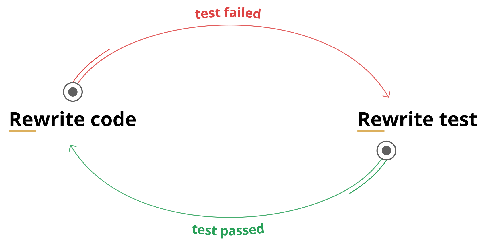

# TDD ошибочно?

> **DISCLAIMER:** вы попались на clickbait. Очевидно, что TDD нельзя назвать ошибочным, но… Всегда есть какое-то _но_.

## Содержание
<!-- START doctoc generated TOC please keep comment here to allow auto update -->
<!-- DON'T EDIT THIS SECTION, INSTEAD RE-RUN doctoc TO UPDATE -->


- [Bступление](#b%D1%81%D1%82%D1%83%D0%BF%D0%BB%D0%B5%D0%BD%D0%B8%D0%B5)
- [Tесты и есть проблема!](#t%D0%B5%D1%81%D1%82%D1%8B-%D0%B8-%D0%B5%D1%81%D1%82%D1%8C-%D0%BF%D1%80%D0%BE%D0%B1%D0%BB%D0%B5%D0%BC%D0%B0)
  - [Hемного истории](#h%D0%B5%D0%BC%D0%BD%D0%BE%D0%B3%D0%BE-%D0%B8%D1%81%D1%82%D0%BE%D1%80%D0%B8%D0%B8)
  - [Hебольшая викторина](#h%D0%B5%D0%B1%D0%BE%D0%BB%D1%8C%D1%88%D0%B0%D1%8F-%D0%B2%D0%B8%D0%BA%D1%82%D0%BE%D1%80%D0%B8%D0%BD%D0%B0)
- [Oбзор TDD](#o%D0%B1%D0%B7%D0%BE%D1%80-tdd)
  - [Tесты - это формализованные требования](#t%D0%B5%D1%81%D1%82%D1%8B---%D1%8D%D1%82%D0%BE-%D1%84%D0%BE%D1%80%D0%BC%D0%B0%D0%BB%D0%B8%D0%B7%D0%BE%D0%B2%D0%B0%D0%BD%D0%BD%D1%8B%D0%B5-%D1%82%D1%80%D0%B5%D0%B1%D0%BE%D0%B2%D0%B0%D0%BD%D0%B8%D1%8F)
  - [TDD поощряет хорошую архитектуру](#tdd-%D0%BF%D0%BE%D0%BE%D1%89%D1%80%D1%8F%D0%B5%D1%82-%D1%85%D0%BE%D1%80%D0%BE%D1%88%D1%83%D1%8E-%D0%B0%D1%80%D1%85%D0%B8%D1%82%D0%B5%D0%BA%D1%82%D1%83%D1%80%D1%83)
  - [TDD экономит время](#tdd-%D1%8D%D0%BA%D0%BE%D0%BD%D0%BE%D0%BC%D0%B8%D1%82-%D0%B2%D1%80%D0%B5%D0%BC%D1%8F)
  - [Tесты - это лучшая документация](#t%D0%B5%D1%81%D1%82%D1%8B---%D1%8D%D1%82%D0%BE-%D0%BB%D1%83%D1%87%D1%88%D0%B0%D1%8F-%D0%B4%D0%BE%D0%BA%D1%83%D0%BC%D0%B5%D0%BD%D1%82%D0%B0%D1%86%D0%B8%D1%8F)
  - [Hемного выводов](#h%D0%B5%D0%BC%D0%BD%D0%BE%D0%B3%D0%BE-%D0%B2%D1%8B%D0%B2%D0%BE%D0%B4%D0%BE%D0%B2)
- [B чём же решение?](#b-%D1%87%D1%91%D0%BC-%D0%B6%D0%B5-%D1%80%D0%B5%D1%88%D0%B5%D0%BD%D0%B8%D0%B5)
    - [Hесколько примеров](#h%D0%B5%D1%81%D0%BA%D0%BE%D0%BB%D1%8C%D0%BA%D0%BE-%D0%BF%D1%80%D0%B8%D0%BC%D0%B5%D1%80%D0%BE%D0%B2)
    - [Hемного про планы](#h%D0%B5%D0%BC%D0%BD%D0%BE%D0%B3%D0%BE-%D0%BF%D1%80%D0%BE-%D0%BF%D0%BB%D0%B0%D0%BD%D1%8B)

<!-- END doctoc generated TOC please keep comment here to allow auto update -->

## Bступление
Первые шесть лет своей карьеры я фрилансил и участвовал в начальных этапах жизни мелких стартапов. В этих проектах не было тестов… Реально, ни единого.

В этих условиях ты обязан реализовать фичи на _вчера_. Поскольку требования рынка постоянно меняются, тесты устаревают ещё до того, как ты их заканчиваешь. И даже эти тесты можно создать только, если ты уверен в том, что именно ты хочешь создать, а это не всегда так. Занимаясь R&D ты вполне можешь не знать каков должен быть конечный результат. И даже достигая определённых успехов, ты не можешь быть уверен, что завтра рынок (а с ним и требования) не изменятся. В целом, существуют бизнес причины для экономии времени на тестировании.

Согласен, наша отрасль - это не только стартапы.  
Около двух лет назад я устроился в достаточно большую аутсорсинг компанию, которая обслуживает клиентов любых размеров.  
Во время разговоров на кухне/курилке, я обнаружил, что практически все согласны с тем, что юнит-тестирование и TDD это своего рода _best practice_. Но во всех проектах этой компании, в которых я участвовал, не было тестов. И нет, не я принимал такое решение. Конечно же, у нас есть проекты с отличным покрытием тестами, но они ещё и довольно сильно бюрократизированы.

_Так в чём же проблема?_  
Почему все соглашаются, что TDD это хорошо, но никто не хочет его применять?  
**Может TDD ошибочно?** – Нет!  
**Возможно, в нём нет никакой выгоды для бизнеса?** – И опять, нет!  
**Может просто разработчики ленивы?** – Да! Но это не причина.  
**Проблема в самих тестах!**  
Я понимаю, что звучит это странно, но я попытаюсь это доказать. 

## Tесты и есть проблема!
Исходя из [этого исследования](https://stateofjs.com/) наименьшая общая удовлетворённость во всей экосистеме принадлежит именно `инструментам для тестирования`. Так было в 2016 и 2017 годах. Я не нашёл более ранних исследований, но это уже не очень важно.

### Hемного истории
В **2008** году вышел один из первых фреймворков для тестирования ([QUnit](https://qunitjs.com/)).  
В **2010** появился [Jasmine](https://jasmine.github.io/).  
В **2011** – [Mocha](https://mochajs.org/).  
Первый релиз [Jest](https://facebook.github.io/jest/), который я нашёл, был в **2014**.


Для сравнения.  
В **2010** зарелизился [angular.js](https://angularjs.org/).  
[Ember](https://www.emberjs.com/) появился в **2011**.  
[React](https://reactjs.org/) - **2013**.  
И так далее…

> Во время написания этой статьи не был создан ни один JS фреймворк...  
Во всяком случае, мной.


За этот же период времени мы увидели взлёт и падение [grunt](https://gruntjs.com/), потом [gulp](https://gulpjs.com/), после чего осознали всю мощь [npm scripts](https://docs.npmjs.com/misc/scripts) и вышел в свет стабильный релиз [webpack](https://webpack.js.org/).


Всё поменялось за последние 10 лет. Всё кроме тестирования.

### Hебольшая викторина
Давайте проверим ваши знания. Что это за библиотеки/фреймворки?  
1:
```JavaScript
var hiddenBox = $("#banner-message");
$("#button-container button").on("click", function(event) {
    hiddenBox.show();
});
```
2:  
```TypeScript
@Component({
    selector: 'app-heroes',
    templateUrl: './heroes.component.html',
    styleUrls: ['./heroes.component.css']
})
export class HeroesComponent{
    hero: Hero = {
        id: 1,
        name: 'Windstorm'
    };

    constructor() { }
}
```
3:  
```JavaScript
function Avatar(props) {
    return (
        
    );
}
```
Ответы:  
1. [JQuery](https://jquery.com/)
2. [Angular2+](https://angular.io/)
3. [React](https://reactjs.org/)

Хорошо. Я уверен, что все ваши ответы были верны. Но что на счёт этих фреймворков для тестирования?  
1:  
```JavaScript
var assert = require('assert');
describe('Array', function() {
  describe('#indexOf()', function() {
    it('should return -1 when the value is not present', function() {
      assert.equal([1,2,3].indexOf(4), -1);
    });
  });
});
```
2:  
```JavaScript
const sum = require('./sum');

test('adds 1 + 2 to equal 3', () => {
  expect(sum(1, 2)).toBe(3);
});
```
3:  
```JavaScript
test('timing test', function (t) {
    t.plan(2);
    
    t.equal(typeof Date.now, 'function');
    var start = Date.now();
    
    setTimeout(function () {
        t.equal(Date.now() - start, 100);
    }, 100);
});
```
4:  
```JavaScript
let When2IsAddedTo2Expect4 = 
    Assert.AreEqual(4, 2+2)
```
Ответы:  
1. [Mocha](https://mochajs.org/)
2. [Jest](https://facebook.github.io/jest/)
3. [Tape](https://github.com/substack/tape)
4. [Тест для F#](http://fsharp.org/)

Вы могли угадать некоторые из них, но, в целом, они все очень похожи. Заметьте, что даже при смене языка, мало что меняется.

У нас есть, как минимум, **8 лет опыта** юнит-тестирования в мире JavaScript'а. 
Но мы ведь просто адаптировали уже существующее на тот момент. Юнит-тестирование, как мы его знаем, появилось намного раньше. Если взять релиз [Test Anything Protocol](https://en.wikipedia.org/wiki/Test_Anything_Protocol) (1987) как точку отсчёта, то мы используем текущие подходы дольше, чем я живу.

[TDD](https://en.wikipedia.org/wiki/Test-driven_development) ненамного моложе, [если не старше](https://www.quora.com/Why-does-Kent-Beck-refer-to-the-rediscovery-of-test-driven-development-Whats-the-history-of-test-driven-development-before-Kent-Becks-rediscovery). Всё это приводит нас к тому, что мы уже можем объективно оценить все плюсы и минусы.

## Oбзор TDD
Давайте вспомним, что такое TDD.

> **Разработка через тестирование** (англ. test-driven development, **TDD**) — техника разработки программного обеспечения, которая основывается на повторении очень коротких циклов разработки: сначала пишется тест, покрывающий желаемое изменение, затем пишется код, который позволит пройти тест, и под конец проводится рефакторинг нового кода к соответствующим стандартам. **(с)** [википедия](https://ru.wikipedia.org/wiki/%D0%A0%D0%B0%D0%B7%D1%80%D0%B0%D0%B1%D0%BE%D1%82%D0%BA%D0%B0_%D1%87%D0%B5%D1%80%D0%B5%D0%B7_%D1%82%D0%B5%D1%81%D1%82%D0%B8%D1%80%D0%BE%D0%B2%D0%B0%D0%BD%D0%B8%D0%B5)


Но что это нам даёт?

### Tесты - это формализованные требования
Это правда только частично.

TDD как практика была _"переизобретена"_ Кентом Беком в 1999 году, в то время как [Agile Manifesto](http://agilemanifesto.org/) был принят только 2 года спустя (в 2001). Я должен это подчеркнуть, что бы вы поняли, что TDD родился в "Золотой век" [каскадной модели](https://ru.wikipedia.org/wiki/%D0%9A%D0%B0%D1%81%D0%BA%D0%B0%D0%B4%D0%BD%D0%B0%D1%8F_%D0%BC%D0%BE%D0%B4%D0%B5%D0%BB%D1%8C) и этот факт определяет наиболее благоприятные условия и процессы, для которых он и был спроектирован. Очевидно, что TDD будет лучше всего работать именно в таких условиях.

Так что, если вы работаете в проекте, где:

1. Требования ясны;
2. Вы полностью их понимаете;
3. Они стабильны и не будут часто меняться.

Вы можете создавать тесты, как формализацию требований.  
Но что бы использовать _существующие_ тесты таким же образом, необходимо выполнение и следующих пунктов тоже:

1. В тестах нет ошибок;
2. Они актуальны;
3. И они покрывают почти все сценарии использования (не путать с покрытием кода).

Так что **"Тесты - это формализованные требования"** - правда только тогда, когда эти требования существуют _до_ начала самой разработки, как в "модели Водопад" или проектах [NASA](https://www.nasa.gov/), где "клиенты" это ученые и инженеры.

> В определённых условиях это будет работать и с "Agile" процессами. Особенно, если что-нибудь по типу [BDD](https://en.wikipedia.org/wiki/Behavior-driven_development) будет использовано, но это уже совсем другая история.

### TDD поощряет хорошую архитектуру
И опять это правда только частично.  
TDD поощряет **модульность**, что необходимо, но недостаточно для хорошей архитектуры.

Качество архитектуры зависит от разработчиков. Опытные разработчики способны создавать отличный код, несмотря на использование или неиспользование юнит-тестирования.  
С другой стороны, слабые разработчики будут создавать низкокачественный код, покрытый низкокачественными тестами, потому что создание хороших тестов - это своего рода искусство, как и само программирование.

> Конечно, тесты как секс: "лучшие плохой, чем никакого вовсе". Но...

Этот тест никак не продвинет вас на пути к хорошему дизайну системы:
```TypeScript
import { inject, TestBed } from '@angular/core/testing';

import { UploaderService } from './uploader.service';

describe('UploaderService', () => {
    beforeEach(() => {
        TestBed.configureTestingModule({
            providers: [UploaderService],
        });
    });

    it('should be created', inject([UploaderService], (service: UploaderService) => {
        expect(service).toBeTruthy();
    }));
});
```
Потому, что он ничего не тестирует.
> Обратите внимание, мы использовали 15 строк кода, чтобы ничего не протестировать.

Но и этот тест не сделает дизайн вашей системы лучше:
```JavaScript
var IotSimulation = artifacts.require("./IotSimulation.sol");
var SmartAsset = artifacts.require("./SmartAsset.sol");
var BuySmartAsset = artifacts.require("./BuySmartAsset.sol");

var BigInt = require('big-integer');

contract('BuySmartAsset', function (accounts) {

    it("Should sell asset", async () => {
        var deliveryCity = "Lublin";

        var extra = 1000; //
        var gasPrice = 100000000000;


        const smartAsset = await SmartAsset.deployed();
        const iotSimulation = await IotSimulation.deployed();
        const buySmartAsset = await BuySmartAsset.deployed()

        const result = await smartAsset.createAsset(Date.now(), 200, "docUrl", 1, "email@email1.com", "Audi A8", "VIN02", "black", "2500", "car");
        const smartAssetGeneratedId = result.logs[0].args.id.c[0];

        await iotSimulation.generateIotOutput(smartAssetGeneratedId, 0);
        await iotSimulation.generateIotAvailability(smartAssetGeneratedId, true);
        await smartAsset.calculateAssetPrice(smartAssetGeneratedId);

        const assetObjPrice = await smartAsset.getSmartAssetPrice(smartAssetGeneratedId);
        assert.isAbove(parseInt(assetObjPrice), 0, 'price should be bigger than 0');

        await smartAsset.makeOnSale(smartAssetGeneratedId);

        var assetObj = await smartAsset.getAssetById.call(smartAssetGeneratedId);
        assert.equal(assetObj[9], 3, 'state should be OnSale = position 3 in State enum list');

        await smartAsset.makeOffSale(smartAssetGeneratedId);
        assetObj = await smartAsset.getAssetById.call(smartAssetGeneratedId);
        assert.equal(assetObj[9], 2, 'state should be PriceCalculated = position 2 in State enum list');

        await smartAsset.makeOnSale(smartAssetGeneratedId);

        const calculatedTotalPrice = await buySmartAsset.getTotalPrice.call(smartAssetGeneratedId, '112', '223');
        await buySmartAsset.buyAsset(smartAssetGeneratedId, '112', '223', { from: accounts[1], value: BigInt(calculatedTotalPrice.toString()).add(BigInt(extra)) });

        assetObj = await smartAsset.getAssetById.call(smartAssetGeneratedId);
        assert.equal(assetObj[9], 0, 'state should be ManualDataAreEntered = position 0 in State enum list');
        assert.equal(assetObj[10], accounts[1]);

        const balanceBeforeWithdrawal = await web3.eth.getBalance(accounts[1]);
        const gas = await buySmartAsset.withdrawPayments.estimateGas({ from: accounts[1] });
        await buySmartAsset.withdrawPayments({ from: accounts[1], gasPrice: gasPrice });

        const balanceAfterWithdrawal = await web3.eth.getBalance(accounts[1]);

        var totalGas = gas * gasPrice;

        assert.isOk((BigInt(balanceAfterWithdrawal.toString()).add(BigInt(totalGas))).eq(BigInt(balanceBeforeWithdrawal.toString()).add(BigInt(extra))));
    })
})
```
Наибольшая проблема этого теста - это изначальная кодовая база, но даже в таком случае его можно было существенно улучшить, даже без рефакторинга уже работающего проекта.

Вообще, влияние TDD на итоговую архитектуру приблизительно на том же уровне, что и влияние выбранной библиотеки/фреймворка, если не меньше (например, [Nest](https://nestjs.com/), [RxJs](https://github.com/Reactive-Extensions/RxJS) и [MobX](https://github.com/mobxjs/mobx), по моему личному мнению, влияют существенно сильнее).

Но ни TDD, ни фреймворки не спасут от плохого кода и неудачных архитектурных решений.

> Не существует **серебряной пули**.

### TDD экономит время
А это уже зависит от многих факторов...  
Давайте предположим, что:

1. Все в проекте достаточно хорошо владеют выбранным тестовым инструментом, методологией TDD и лучшими практиками юнит-тестирования;
2. И все понимают всё вышеперечисленное одинаково;
3. А требования прозрачны и стабильны;
4. К тому же, команда разработчиков понимает их точно так же, как и "Product Owner";
5. А менеджмент готов решать все организационные проблемы, вызванные TDD (например, более длинный процесс ввода новых разработчиков в команду).

Даже в этом случае, вам необходимо сначала инвестировать время и усилия, что удлинит начальную фазу разработки и только спустя какое-то время вы получите выгоду, сократив необходимое время на исправление ошибок и поддержку продукта.  
Конечно, второе может быть больше чем стартовая инвестиция и в этом случае выгода от TDD очевидна.  
Так же в некоторых случаях вы сможете сэкономить время и на внедрении новой функциональности, поскольку тесты будут сразу выявлять непреднамеренные изменения.  
Но в реальном мире, который очень динамичен, требования могут измениться и то, что было корректным поведением раньше, станет некорректным. В этом случае вам необходимо переписать тесты в связи с новыми реалиями. И, очевидно, приложить новые усилия, которые не окупятся сразу же.

Вы даже можете попасть в цикл подобного типа:



Ладно, этот цикл противоречит принципам TDD. Но следующий уже нет:


Попробуйте найти в них значимые различия.

### Tесты - это лучшая документация
Нет. Они хороши в этом, но однозначно не лучшие.

Давайте взглянем на [документацию angular](https://angular.io/docs):


Или [react](https://reactjs.org/docs/):


Как вы думаете, что в них общего? - Они обе построены на **примерах кода**. И даже более того. Все эти примеры можно легко запустить (angular использует [StackBlitz](https://stackblitz.com), а react - [CodePen](https://codepen.io)), так что вы можете увидеть, что оно даёт на выходе и что произойдёт, если вы что-то измените.  
Конечно же, там так же есть и простой текст, но это как комментарии в коде - они вам нужны только если вы что-то не поняли из самого кода.

_**Исполняемые примеры кода**_ - вот лучшая документация!

Тесты близки к этому, но недостаточно.
```TypeScript
describe('ReactTypeScriptClass', function() {
  beforeEach(function() {
    container = document.createElement('div');
    attachedListener = null;
    renderedName = null;
  });

  it('preserves the name of the class for use in error messages', function() {
    expect(Empty.name).toBe('Empty');
  });

  it('throws if no render function is defined', function() {
    expect(() =>
      expect(() =>
        ReactDOM.render(React.createElement(Empty), container)
      ).toThrow()
    ).toWarnDev([
      // A failed component renders twice in DEV
      'Warning: Empty(...): No `render` method found on the returned ' +
        'component instance: you may have forgotten to define `render`.',
      'Warning: Empty(...): No `render` method found on the returned ' +
        'component instance: you may have forgotten to define `render`.',
    ]);
  });
```
Это небольшой кусочек из [реального теста в react](https://github.com/facebook/react/blob/master/packages/react/src/__tests__/ReactTypeScriptClass-test.ts). Мы можем выделить примеры кода из него:
```TypeScript
container = document.createElement('div');
Empty.name;
```
```TypeScript
container = document.createElement('div');
ReactDOM.render(React.createElement(Empty), container);
```
Всё остальное это вручную написанный инфраструктурный код.

Давайте будем честными, пример теста выше намного менее читабельный чем настоящая документация. И проблема не в этом конкретном тесте - я уверен, что ребят из [facebook](https://www.facebook.com/) знают, как писать хороший код и хорошие тесты :) Весь этот мусор из инструментов тестирования и assertion библиотек, как `it`, `describe`, `test`, `to.be.true` просто захламляет ваши тесты.

> Кстати, есть библиотека, которая называется [tape](https://github.com/substack/tape) с минималистичным API, потому что любой тест можно переписать, используя только `equal`/`deepEqual`, а думать в этих терминах это в целом хорошая практика для юнит-тестирования. Но даже тестам для `tape` ещё очень далеко до просто **исполняемых примеров кода**.

Но стоит заметить, что тесты всё ещё вполне пригодны для использования в качестве документации. У них действительно ниже вероятность быть устаревшими, а наше сознание просто выкидывает лишнее, когда мы их читаем. Если мы попробуем визуализировать то, во что превращается тест в нашей голове, то это будет выглядеть приблизительно так:


Как вы видите, это уже намного ближе к реальной доке, чем изначальный тест.

### Hемного выводов

1. **Тесты - это формализованные требования** если они стабильны;
2. **TDD поощряет хорошую архитектуру** если разработчики достаточно квалифицированы;
3. **TDD экономит время** если вы его вложите сначала;
4. **Тесты - это лучшая документация** если нет других исполняемых примеров кода.

**Значит TDD всё-таки ошибочно?** - Нет, TDD не ошибочно.  
Оно указывает правильно направление и поднимает важные вопросы. Мы просто должны переосмыслить и изменить способ его применения.

## B чём же решение?
Не воспринимайте TDD как **"серебряную пулю"**.  
Не воспринимайте его даже как процесс по типу Agile, например.  
Вместо этого сфокусируйтесь на его **реальных сильных сторонах**:

1. Предотвращение непреднамеренных изменений, другими словами фиксирование существующего поведения как своего рода 'базовой линии' (англ. термин **'baseline'** нам ещё пригодится);
2. Использование **примеров из документации**, как тестов.

Думайте о юнит-тестировании как о **инструменте разработчика**. Как [линтер](https://eslint.org/) или [компилятор](https://www.typescriptlang.org/), например.

> Вы не будете спрашивать у Product Owner'а разрешения на использование линтера - вы просто будете его использовать.

Когда-нибудь это станет реальностью и для юнит-тестирования. Когда необходимые для TDD усилия будут на уровне использования [тайпчекера](https://flow.org/) или [бандлера](https://webpack.js.org/). Но до этого момента, просто минимизируйте свои затраты, создавая тесты максимально похожими на **исполняемые примеры** и используйте их как **текущий baseline** состояния вашего проекта.

Я понимаю, что это будет сложно, особенно учитывая тот факт, что большинство популярных инструментов спроектированы для других целей.

Правда, я создал один такой, беря во внимание все вышеописанные проблемы. Он называется

[](https://github.com/Igmat/baset)

Базовая концепция очень проста. Пишите код:
```TypeScript
export function sampleFn(a: any, b: any) {
    return a + b + b + a;
}
```
И просто используйте его в вашем тесте:
```TypeScript
import { sampleFn } from './index';

export = {
    values: [
        sampleFn(1, 1),
        sampleFn(1000000, 1000000),
        sampleFn('abc', 'cba'),
        sampleFn(1, 'abc'),
        sampleFn('abc', 1),
        new Promise(resolve => resolve(sampleFn('async value', 1))),
    ],
};
```
> **NOTE:** тест, конечно же, очень синтетический - просто для демонстрации.

Потом выполняете команду `baset test` и получаете временный baseline:
```JSON
{
    "values": [
        4,
        4000000,
        "abccbacbaabc",
        "1abcabc1",
        "abc11abc",
        "async value11async value"
    ]
}
```
Если значения верны, выполняете `baset accept` и коммитите созданный **baseline** в ваш репозиторий.

Все последующие прогонки тестов буду сравнивать существующий **baseline** со значениями, экспортированными из ваших тестов. Если они отличаются, тест _провален_, иначе - _пройден_.  
Если требования изменились, просто измените код, прогоните тесты и примите **новый baseline**.

Этот инструмент всё ещё оберегает вас от непреднамеренных изменений, при этом требует минимальных усилий. Всё что вам нужно, это просто написать **исполняемый пример кода**, который, к тому же, является основой хорошей документации.

#### Hесколько примеров
Использование с react. Вот этот тест:
```TypeScript
import * as React from 'react';
import { jsxFn } from './index';

export const value = (
    <div>
        {jsxFn('s', 's')}
        {jsxFn('abc', 'cba')}
        {jsxFn('s', 'abc')}
        {jsxFn('abc', 's')}
    </div>
);
```
создаст такой `.md` файл как **baseline**:

---
`exports.value:`

```HTML
<div data-reactroot="">
    <div class="cssCalss">
        ss
    </div>
    <div class="cssCalss">
        abccba
    </div>
    <div class="cssCalss">
        sabc
    </div>
    <div class="cssCalss">
        abcs
    </div>
</div>
```

---
Или с [pixi.js](http://www.pixijs.com/):
```TypeScript
import 'pixi.js';
interface IResourceDictionary {
    [index: string]: PIXI.loaders.Resource;
}

const ASSETS = './assets/assets.json';
const RADAR_GREEN = 'Light_green';

const getSprite = async () => {
    await new Promise(resolve => PIXI.loader
        .add(ASSETS)
        .load(resolve));

    return new PIXI.Sprite(PIXI.utils.TextureCache[RADAR_GREEN]);
};

export const sprite = getSprite();
```
Этот тест создаст такой **baseline**:

---
`exports.sprite:`


---

#### Hемного про планы
Я обязан сказать, что этот инструмент ещё на очень ранней стадии разработки и впереди ещё очень много [нововведений](https://github.com/Igmat/baset/milestone/1), например:

1. [Watch/Workflow mode](https://github.com/Igmat/baset/issues/65)
2. [TAP compatibility](https://github.com/Igmat/baset/issues/55)
3. [Git acceptance strategy](https://github.com/Igmat/baset/issues/69)
4. [VS Code extension](https://github.com/Igmat/baset/issues/74)
5. ...и, как минимум, 24 других.

Только около 40% от запланированного было реализовано. Но вся базовая функциональность уже работает, так что можете попробовать поиграться с ней. Может быть вам даже понравится, кто знает?
